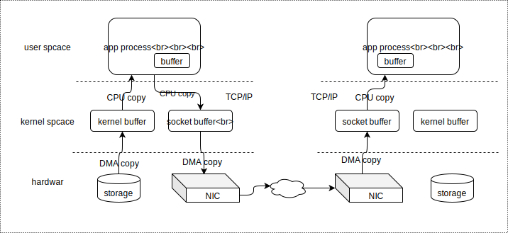
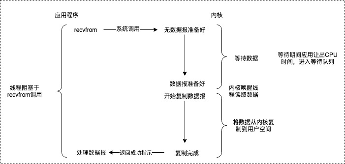
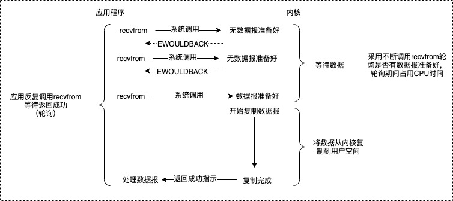
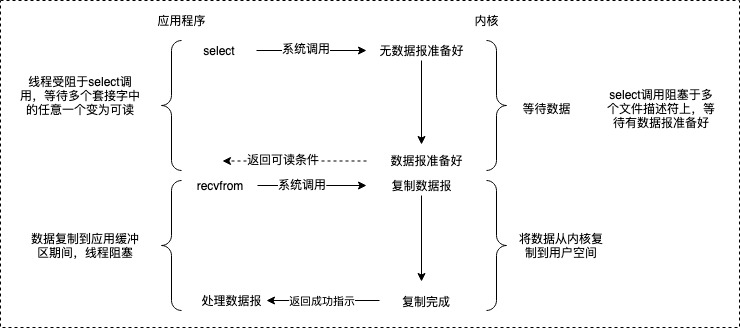
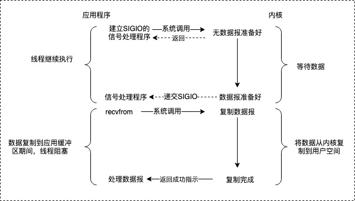
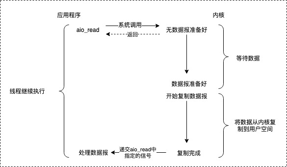
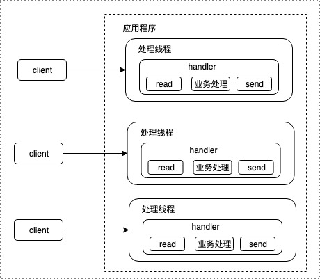
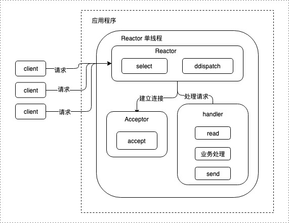
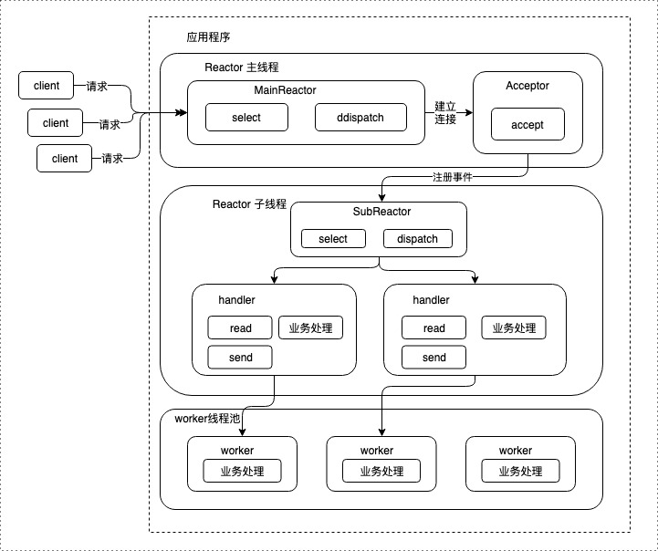

#### IO、线程模型

##### 一、典型的网络请求过程

服务端并发设计的两个关键点：

- 如何处理连接，获取输入数据
- 如何处理请求

以上两个点与系统的IO模型和线程模型有关。

##### 二、IO模型

1. IO模型相关的几个概念
   - 阻塞：阻塞调用是指调用结果返回之前，当前线程会被挂起，调用线程只有在得到结果之后才会返回
   - 非阻塞：非阻塞调用指在不能立刻得到结果之前，该调用不会阻塞当前线程
   - 同步：指被调用方得到最终结果之后才返回给调用方
   - 异步：指被调用方先返回应答，然后再计算调用结果，计算完最终结果后再通知并返回给调用方

> 阻塞、非阻塞的讨论对象是调用者；
>
> 同步、异步的讨论对象是被调用者。

​	名词说明

	- 内核空间与用户空间：现在操作系统都是采用虚拟存储器，操作系统将虚拟空间划分为两部分，一部分为内核空间，一部分为用户空间。
	- 进程切换：为了控制进程的执行，内核必须有能力挂起正在CPU上运行的进程，并恢复以前挂起的某个进程的执行。
	- 文件描述符fd：是一个用于表述指向文件的引用的抽象化概念，形式上，它是一个索引值，指向内核为每一个进程所维护的该进程打开文件的记录表。
	- 缓存IO：数据会先被拷贝到操作系统内核的缓冲区中，然后才会从操作系统内核的缓冲区拷贝到应用程序的地址空间。

2. 阻塞式I/O（blocking I/O）

   

   在阻塞式 I/O 模型中，应用程序在从调用 recvfrom 开始到它返回有数据报准备好这段时间是阻塞的，recvfrom 返回成功后，应用进程开始处理数据报。

   - 优点：程序简单，在阻塞等待数据期间进程/线程挂起，基本不会占用 CPU 资源。
   - 缺点：每个连接需要独立的进程/线程单独处理，当并发请求量大时为了维护程序，内存、线程切换开销较大，这种模型在实际生产中很少使用。

3. 非阻塞式I/O（non-blocking I/O）

   

   在非阻塞式 I/O 模型中，应用程序把一个套接字设置为非阻塞，就是告诉内核，当所请求的 I/O 操作无法完成时，不要将线程睡眠。

   而是返回一个错误，应用程序基于 I/O 操作函数将不断的轮询数据是否已经准备好，如果没有准备好，继续轮询，直到数据准备好为止。

   - 优点：不会阻塞在内核的等待数据过程，每次发起的 I/O 请求可以立即返回，不用阻塞等待，实时性较好。

   - 缺点：轮询将会不断地询问内核，这将占用大量的 CPU 时间，系统资源利用率较低，所以一般 Web 服务器不使用这种 I/O 模型。

4. I/O复用模型（I/O multiplexing）

   

   在 I/O 复用模型中，会用到 Select 或 Poll 函数或 Epoll 函数(Linux 2.6 以后的内核开始支持)，这两个函数也会使进程阻塞，但是和阻塞 I/O 有所不同。

   这两个函数可以同时阻塞多个 I/O 操作，而且可以同时对多个读操作，多个写操作的 I/O 函数进行检测，直到有数据可读或可写时，才真正调用 I/O 操作函数。

   - 优点：可以基于一个阻塞对象，同时在多个描述符上等待就绪，而不是使用多个线程(每个文件描述符一个线程)，这样可以大大节省系统资源。

   - 缺点：当连接数较少时效率相比多线程+阻塞 I/O 模型效率较低，可能延迟更大，因为单个连接处理需要 2 次系统调用，占用时间会有增加。

5. 信号驱动式I/O模型（signal driven I/O）

   

   在信号驱动式 I/O 模型中，应用程序使用套接口进行信号驱动 I/O，并安装一个信号处理函数，进程继续运行并不阻塞。

   当数据准备好时，进程会收到一个 SIGIO 信号，可以在信号处理函数中调用 I/O 操作函数处理数据。

   - 优点：线程并没有在等待数据时被阻塞，可以提高资源的利用率。

   - 缺点：信号 I/O 在大量 IO 操作时可能会因为信号队列溢出导致没法通知。

6. 异步I/O模型（asynchronous I/O）

   

   由 POSIX 规范定义，应用程序告知内核启动某个操作，并让内核在整个操作（包括将数据从内核拷贝到应用程序的缓冲区）完成后通知应用程序。

   这种模型与信号驱动模型的主要区别在于：信号驱动 I/O 是由内核通知应用程序何时启动一个 I/O 操作，而异步 I/O 模型是由内核通知应用程序 I/O 操作何时完成。

   - 优点：异步 I/O 能够充分利用 DMA 特性，让 I/O 操作与计算重叠。

   - 缺点：要实现真正的异步 I/O，操作系统需要做大量的工作。目前 Windows 下通过 IOCP 实现了真正的异步 I/O。

##### 三、select()、poll()和epoll()

这三个函数是文件描述符状态监控的函数，它们可以监控一系列文件的一系列事件，当出现满足条件的事件后，就认为是就绪或者错误。事件大致分为3类：可读事件、可写事件和异常事件。它们通常都放在循环结构中进行循环监控。

select()和poll()函数处理方式的本质类似，只不过poll()稍微先进一点，而epoll处理方式就比这两个函数先进多了。当然，就算是先进分子，在某些情况下性能也不一定就比老家伙们强。

1. select、poll

   首先，通过FD_SET宏函数创建待监控的描述符集合，并将此描述符集合作为select()函数的参数，可以在指定select()函数阻塞时间间隔，于是select()就创建了一个监控对象。例如recv buffer中是否收到了数据，也即监控套接字的可读性，send buffer中是否满了，也即监控套接字的可写性。select()默认最大可监控1024个文件描述符。

   poll的实现和select非常相似，只是描述fd集合的方式不同，poll使用pollfd结构而不是select的fd_set结构，poll()没有文件描述符大小限制。

   select()的时间间隔参数分3种：

   - 设置为指定时间间隔内阻塞，除非之前有就绪事件发生。
   - 设置为永久阻塞，除非有就绪事件发生。
   - 设置为完全不阻塞，即立即返回。但因为select()通常在循环结构中，所以这是轮询监控的方式。

   当创建了监控对象后，由内核监控这些描述符集合，于此同时调用select()的进程被阻塞(或轮询)。当监控到满足就绪条件时(监控事件发生)，select()将被唤醒(或暂停轮询)，于是select()返回**满足就绪条件的描述符数量**，之所以是数量而不仅仅是一个，是因为多个文件描述符可能在同一时间满足就绪条件。由于只是返回数量，并没有返回哪一个或哪几个文件描述符，所以通常在使用select()之后，还会在循环结构中的if语句中使用宏函数FD_ISSET进行遍历，直到找出所有的满足就绪条件的描述符。最后将描述符集合通过指定函数拷贝回用户空间，以便被进程处理。

   > 1. select 缺点：单个进程所打开的fd有限制；对socket进行扫描时是线性扫描，即采用轮询的方法，效率较低；需要维护一个用来存放大量fd的数据结构，这样会使得用户空间和内核空间在传递该结构时复制开销大。
   > 2. 大量的fd的数组被整体复制于用户态和内核地址空间之间，而不管这样的复制是不是有意义；poll还有一个特点是“水平触发”，如果报告了fd后，没有被处理，那么下次poll时会再次报告该fd。

2. epoll

   epoll比poll、select先进，考虑以下几点，自然能看出它的优势所在：

   - epoll_create()创建的epoll实例可以随时通过epoll_ctl()来新增和删除感兴趣的文件描述符，不用再和select()每个循环后都要使用FD_SET更新描述符集合的数据结构。
   - 在epoll_create()创建epoll实例时，还创建了一个epoll就绪链表list。而epoll_ctl()每次向epoll实例添加描述符时，还会注册该描述符的回调函数。当epoll实例中的描述符满足就绪条件时将触发回调函数，被移入到就绪链表list中。
   - 当调用epoll_wait()进行监控时，它只需确定就绪链表中是否有数据即可，如果有，将复制到用户空间以被进程处理，如果没有，它将被阻塞。当然，如果监控的对象设置为非阻塞模式，它将不会被阻塞，而是不断地去检查。

   也就是说，epoll的处理方式中，根本就无需遍历描述符集合。

##### 四、线程模型

1. 阻塞IO服务模型

   

   特点：

   - 采用阻塞式 I/O 模型获取输入数据；

   - 每个连接都需要独立的线程完成数据输入，业务处理，数据返回的完整操作。

   缺点：

   - 当并发数较大时，需要创建大量线程来处理连接，系统资源占用较大；

   - 连接建立后，如果当前线程暂时没有数据可读，则线程就阻塞在 Read 操作上，造成线程资源浪费。

2. Reactor线程模型

   Reactor 模式，是指一个或多个输入同时传递给服务器请求的事件驱动处理模式。 服务端处理传入多路请求，并将它们同步分派给请求对应的处理线程，Reactor 模式也叫 Dispatcher 模式。即 I/O 多了复用统一监听事件，收到事件后分发(Dispatch 给某进程)，是编写高性能网络服务器的必备技术之一。

   特点：

   - 基于 I/O 复用模型：多个连接共用一个阻塞对象，应用程序只需要在一个阻塞对象上等待，无需阻塞等待所有连接。当某条连接有新的数据可以处理时，操作系统通知应用程序，线程从阻塞状态返回，开始进行业务处理；
   - 2）基于线程池复用线程资源：不必再为每个连接创建线程，将连接完成后的业务处理任务分配给线程进行处理，一个线程可以处理多个连接的业务。

   Reactor 模式中有 2 个关键组成：

   - Reactor：Reactor 在一个单独的线程中运行，负责监听和分发事件，分发给适当的处理线程来对 IO 事件做出处理。
   - 2）Handlers：处理线程执行 I/O 事件要完成的实际事件，Reactor 通过调度适当的处理线程来响应 I/O 事件，处理程序执行非阻塞操作。

   > 单 Reactor 单线程

   

   **优点：**模型简单，没有多线程、进程通信、竞争的问题，全部都在一个线程中完成。
   **缺点：**性能问题，只有一个线程，无法完全发挥多核 CPU 的性能。Handler 在处理某个连接上的业务时，整个进程无法处理其他连接事件，很容易导致性能瓶颈。

   

   > 单 Reactor 多线程

   

   **优点：**可以充分利用多核 CPU 的处理能力。
   **缺点：**多线程数据共享和访问比较复杂；Reactor 承担所有事件的监听和响应，在单线程中运行，高并发场景下容易成为性能瓶颈。

   

   > 主从 Reactor 多线程

   

   **优点：**父线程与子线程的数据交互简单职责明确，父线程只需要接收新连接，子线程完成后续的业务处理。

   父线程与子线程的数据交互简单，Reactor 主线程只需要把新连接传给子线程，子线程无需返回数据。

   这种模型在许多项目中广泛使用，包括 Nginx 主从 Reactor 多进程模型，Memcached 主从多线程，Netty 主从多线程模型的支持。

