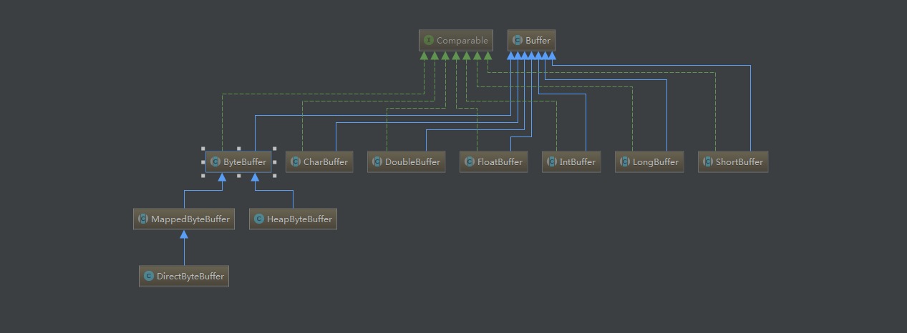
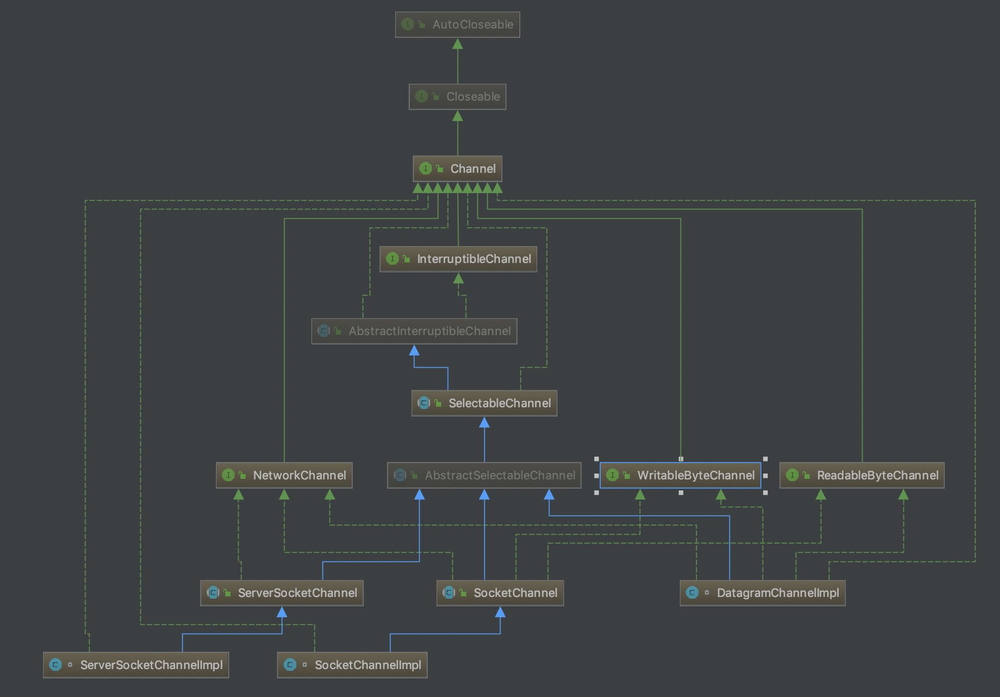
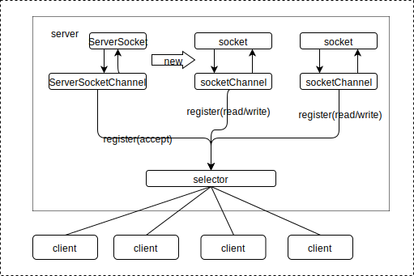

#### NIO

##### NIO Buffer



1. 关键属性

```java
public abstract class Buffer {
    ...
    // Invariants: mark <= position <= limit <= capacity
      private int mark = -1;
      private int position = 0;
      private int limit;
      private int capacity;
    ...
}
```

1. API

   ```java
   public abstract class Buffer {
       //JDK1.4时，引入的api
       public final int capacity( )//返回此缓冲区的容量
       public final int position( )//返回此缓冲区的位置
       public final Buffer position (int newPositio)//设置此缓冲区的位置
       public final int limit( )//返回此缓冲区的限制
       public final Buffer limit (int newLimit)//设置此缓冲区的限制
       public final Buffer mark( )//在此缓冲区的位置设置标记
       public final Buffer reset( )//将此缓冲区的位置重置为以前标记的位置
       public final Buffer clear( )//清除此缓冲区
       public final Buffer flip( )//反转此缓冲区
       public final Buffer rewind( )//重绕此缓冲区
       public final int remaining( )//返回当前位置与限制之间的元素数
       public final boolean hasRemaining( )//告知在当前位置和限制之间是否有元素
       public abstract boolean isReadOnly( );//告知此缓冲区是否为只读缓冲区
   
       //JDK1.6时引入的api
       public abstract boolean hasArray();//告知此缓冲区是否具有可访问的底层实现数组
       public abstract Object array();//返回此缓冲区的底层实现数组
       public abstract int arrayOffset();//返回此缓冲区的底层实现数组中第一个缓冲区元素的偏移量
       public abstract boolean isDirect();//告知此缓冲区是否为直接缓冲区
   }
   
   //flip（）
   public final Buffer flip() {
       limit = position;
       position = 0;
       mark = -1;
       return this;
   }
   //clear()
   public final Buffer clear() {
       position = 0;
       limit = capacity;
       mark = -1;
       return this;
   }
   //重头开始
   public final Buffer rewind() {
       position = 0;
       mark = -1;
       return this;
   }
   //新建一个堆缓存
   public static ByteBuffer wrap(byte[] array,int offset, int length){
      try {
          return new HeapByteBuffer(array, offset, length);
      } catch (IllegalArgumentException x) {
          throw new IndexOutOfBoundsException();
      }
   }
   
   //get
   public byte get() {
       return hb[ix(nextGetIndex())];
   }
   final int nextGetIndex() {                          // package-private
       if (position >= limit)
           throw new BufferUnderflowException();
       return position++;
   }
   
   //put
   public ByteBuffer put(byte x) {
       hb[ix(nextPutIndex())] = x;
       return this;
   }
   
   ```

   

   ##### Channel

   通道(Channel)可以理解为数据传输的管道。通道与流不同的是，流只是在一个方向上移动(一个流必须是inputStream或者outputStream的子类)，而通道可以用于读、写或者同时用于读写。

   

   Channel单向还是双向看它有没有实现ReadableByteChannel、WritableByteChannel接口，实现了这两个接口就是双向的通道。

   ```java
   public interface ReadableByteChannel extends Channel {
       public int read(ByteBuffer dst) throws IOException;
   }
   
   public interface WritableByteChannel extends Channel{
       public int write(ByteBuffer src) throws IOException;
   }
   ```

   - 在通道类中，DatagramChannel 和 SocketChannel 实现定义读和写功能的接口，而 ServerSocketChannel不实现。 ServerSocketChannel 负责监听传入的连接和创建新的 SocketChannel 对象，它本身从不传输数据。

   - 全部 NIO中的socket 通道类（ DatagramChannel、 SocketChannel 和 ServerSocketChannel）在被实例化时都会创建一个对等的BIO中的 socket 对象（ Socket、 ServerSocket和 DatagramSocket）。

   - DatagramChannel、 SocketChannel 和 ServerSocketChannel通道类都定义了socket()方法，我们可以通过这个方法获取其关联的socket对象。另外每个Socket、 ServerSocket和 DatagramSocket都定义了getChannel()方法，来获取对应的通道。

   - 需要注意是，只有通过通道类创建的socket对象，其getChannel方法才能返回对应的通道，如果直接new了socket对象，那么其getChannel方法返回的永远是null。

   

   ##### Selector

   

   在多路复用IO模型中，只需要使用一个线程就可以管理多个socket，并负责处理对应I/O事件。这对于构建高并发、大容量的服务端应用程序来说是非常有意义。多路复用IO模型中，使用了一个Selector对象来管理多个通道，这是实现单个线程可以高效地处理多个socket上I/O事件的关键所在。

   一个Channel对象注册到选择器之后，会返回一个SelectionKey对象，这个SelectionKey对象代表这个Channel和它注册的Selector间的关系。SelectionKey中维护着两个很重要的属性：interestOps、readyOps，并通过这两个属性管理通道上注册的事件和就绪事件。interestOps中保存了我们希望Selector监听Channel的哪些事件，在Selector每次做select操作时，若发现该Channel有我们所监听的事件发生时，就会将感兴趣的监听事件设置到readyOps中，这样我们可以根据事件的发生执行相应的I/O操作。

   1. Selector的重要属性

      每个选择器中管理着三个SelectionKey集合：

      - keys：该集合中保存了所有注册到当前选择器上的通道的SelectionKey对象；
      - selectedKeys：该集合中保存了上一次Selector选择期间，发生了就绪事件的通道的SelectionKey对象集合，它始终是keys的子集。
      - cancelledKeys：该集合保存了已经被取消但其关联的通道还未被注销的SelectionKey对象集合，它始终是keys的子集。

   2. Selection操作

      Selector中提供了3种类型的selection操作：

      - select()：该方法会一直阻塞直到至少一个channel中有感兴趣的事件发生，除非当前线程发生中断或selector的wakeup方法被调用；
      - select(long timeout)：该方法与select()类似，会一直阻塞直到至少一个channel中有感兴趣的事件发生，除非下面3种情况任意一种发生：1 设置的超时时间到达；2 当前线程发生中断；3 selector的wakeup方法被调用；
      - selectNow()：该方法不会发生阻塞，无论是否有channel发生就绪事件，都会立即返回。

   3. SelectionKey
      SelectionKey对象代表着一个Channel和它注册的Selector间的关系。其channel( )方法可返回与该键相关的SelectableChannel对象，而selector( )则返回相关的Selector对象。此外，SelectionKey中包含两个重要属性，两个以整数形式进行编码的比特掩码：

      - interestOps：代表对注册Channel所感兴趣的事件集合。interest集合是使用注册通道时给定的值初始化的，可以通过调用键对象的interestOps( int ops)方法修改。同时，可以调用键对象的interestOps()方法获取当前interest集合。当相关的Selector上的select( )操作正在进行时改变键的interest集合，不会影响那个正在进行的选择操作。所有更改将会在select( )的下一个调用中体现出来；
      - readyOps：代表interest集合中从上次调用select( )以来已经就绪的事件集合，它是interestOps的子集。注册通道时，初始化为0，只有在选择器选择操作期间可能被更新。可以调用键对象的readyOps()方法获取当前ready集合。需注意的是ready集合返回的就绪状态只是一个提示，不是保证。底层的通道在任何时候都会不断改变。其他线程可能在通道上执行操作并影响它的就绪状态。
      - SelectionKey中使用了四个常量来代表事件类型：
        - SelectionKey.OP_READ：通道已经准备好进行读取；
        - SelectionKey.OP_WRITE：通道已经准备好写入；
        - SelectionKey.OP_CONNECT：通道对应的socket已经准备好连接；
        - SelectionKey.OP_ACCEPT：通道对应的server socket已经准备好接受一个新连接。