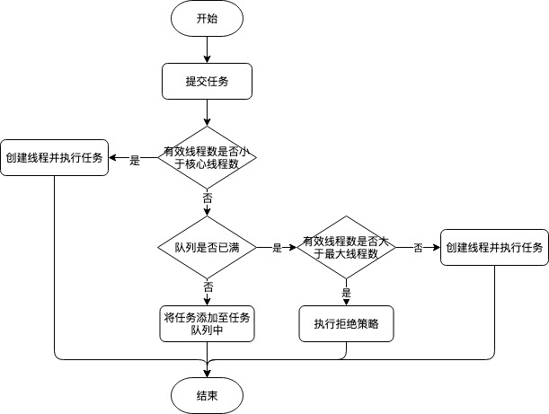

#### 线程池

##### 线程池创建

```java
/**
     * 
     * @param corePoolSize 核心线程数
     * @param maximumPoolSize 最大线程数
     * @param keepAliveTime 空闲线程存活时间
     * @param unit 空闲线程存活时间单位
     * @param workQueue 任务队列
     * @param threadFactory 线程工厂
     * @param handler 拒绝策略
     */
    public ThreadPoolExecutor(
            int corePoolSize,
            int maximumPoolSize,
            long keepAliveTime,
            TimeUnit unit,
            BlockingQueue<Runnable> workQueue,
            ThreadFactory threadFactory,
            RejectedExecutionHandler handler) {}

任务队列的几种实现：
- SynchronousQueue：没有容量，总是将任务交给线程执行，没有线程则新建，大于最大线程数，则执行拒绝
- ArrayBlockingQueue：有界队列，任务大于corePoolSize则将任务加入任务队列，若队列已满，则创建线程，若线程数量大于maxPoolSize则执行拒绝
- LinkedBlockingQueue：无界队列，任务大于corePoolSize加入任务队列，直到资源耗尽

拒绝策略：
AbortPolicy（直接抛异常）
CallerRunsPolicy（调用线程运行被丢弃任务）
DiscardOledestPolicy（丢弃最老任务）
DiscardPolicy（丢弃无法处理的任务）
```


##### 线程池执行任务流程

下面基于有限队列分析一个任务提交到线程池ThreadPoolExecutor execute方法流程，

1. 如果线程池中的线程数量少于corePoolSize(核心线程数量),那么会直接开启一个新的核心线程来执行任务,即使此时有空闲线程存在.
2. 如果线程池中线程数量大于等于corePoolSize(核心线程数量),那么任务会被插入到任务队列中排队,等待被执行.此时并不添加新的线程.
3. 如果在步骤2中由于任务队列已满导致无法将新任务进行排队,这个时候有两种情况:

- 线程数量 [未] 达到maximumPoolSize(线程池最大线程数) , 立刻启动一个非核心线程来执行任务.
- 线程数量 [已] 达到maximumPoolSize(线程池最大线程数) , 拒绝执行此任务.ThreadPoolExecutor会通过RejectedExecutionHandler,抛出RejectExecutionException异常.



```java
public void execute(Runnable command) {
    if (command == null){
        //如果没传入Runnable任务,则抛出空指针异常
        throw new NullPointerException();
    }
    
    int c = ctl.get();
    //当前线程数 小于 核心线程数
    if (workerCountOf(c) < corePoolSize) {
        //直接开启新的线程,并将Runnable传入作为第一个要执行的任务,成功返回true,否则返回false
        if (addWorker(command, true)){
            return;
        }
        c = ctl.get();
    }

    //c < SHUTDOWN代表线程池处于RUNNING状态，将Runnable添加到任务队列,如果添加成功返回true失败返回false
    if (isRunning(c) && workQueue.offer(command)) {
        int recheck = ctl.get();
        //成功加入队列后,再次检查是否需要添加新线程(因为已存在的线程可能在上次检查后销毁了,或者线程池在进入本方法后关闭了)
        if (! isRunning(recheck) && remove(command)){
            //如果线程池处于非RUNNING状态 并且 将该Runnable从任务队列中移除成功,则拒绝执行此任务
            //交给RejectedExecutionHandler调用rejectedExecution方法,拒绝执行此任务
            reject(command);
        }else if (workerCountOf(recheck) == 0){
            //如果线程池线程数量为0,则创建一条新线程,去执行
            addWorker(null, false);
        }   
    }else if (!addWorker(command, false))
        //如果线程池处于非RUNNING状态 或 将Runnable添加到队列失败(队列已满导致),则执行默认的拒绝策略
        reject(command);
}
```


##### 线程池回收线程分析

```java
final void runWorker(Worker w) {
    boolean completedAbruptly = true;
    ...
    try {
        while (task != null || (task = getTask()) != null) {
            ...
            处理任务
        }
        //该线程已经从队列中取不到任务了,改变标记,该标记表示:该线程是否因用户因素导致的异常而终止
         completedAbruptly = false;
    } finally {
        //线程移除
        processWorkerExit(w, completedAbruptly);
    }
}

private Runnable getTask() {
    ...
    for (;;) {
        ...
        // 如果线程池已关闭 或 任务队列为空,则AtomicInteger中记录的线程数量-1,并return null,结束本方法
        if (rs >= SHUTDOWN && (rs >= STOP || workQueue.isEmpty())) {
            decrementWorkerCount();
            return null;
        }
        //获取当前线程池中的总线程数
        int wc = workerCountOf(c);
        //allowCoreThreadTimeOut参数是使用者自行设置的(默认false),用来设置:是否允许核心线程有超时策略
        //条件1:核心线程超时 条件2:当前线程数 > 核心线程数,满足任何一个条件则timed标记为true 
        boolean timed = allowCoreThreadTimeOut || wc > corePoolSize;

        //超过最大线程数 或 超时 或 任务队列为空...  线程数量-1 + return null
        ...
        try {
            //根据timed标记,使用不同的方式(限时等待 or 阻塞)从BlockingQueue<Runnable> workQueue 队列中取任务
            Runnable r = timed ? workQueue.poll(keepAliveTime, TimeUnit.NANOSECONDS) : workQueue.take();
            if (r != null){
                //如果取到了,就将Runnable返回
                return r;
            }
            //如果没取到,则重新for循环
            ...
        }
    }
}

private void processWorkerExit(Worker w, boolean completedAbruptly) {
    ...
    try {
        //记录该线程完成任务的总数
        completedTaskCount += w.completedTasks;
        //从worker集合中移除本worker(线程)
        workers.remove(w);
    }
    ...
    //如果在runWoker()中正常执行任务完毕,这里completedAbruptly传入的就是false
    if (!completedAbruptly) {
        int min = allowCoreThreadTimeOut ? 0 : corePoolSize;
        //如果线程池里最少线程数为0,但是此时任务队列里依然还有任务
        if (min == 0 && ! workQueue.isEmpty()){
            //那么必须保留一条线程,所以将最小值设置为1
            min = 1;
        }
        //如果当前线程数>= 最小线程数,则直接return
        if (workerCountOf(c) >= min){
            return; 
        }
    }
    //否则添加一条新线程,来替代当前线程,继续去执行队列中的任务.
    addWorker(null, false);
}
```

processWorkerExit这里用来将worker从worker集合中移除,步骤如下:

1. 先移除传入的Worker(线程)
2. 判断线程池里的最少线程数,如果最少线程数为0条,但是队列里依然有任务未执行完毕.那么必须确保线程池中至少有1条线程.(将最小线程数置为1)
3. 如果当前线程数 > 最小线程数,本方法结束,不再往下执行
4. 否则添加一条新线程,来替代当前线程,继续去执行队列中的任务.