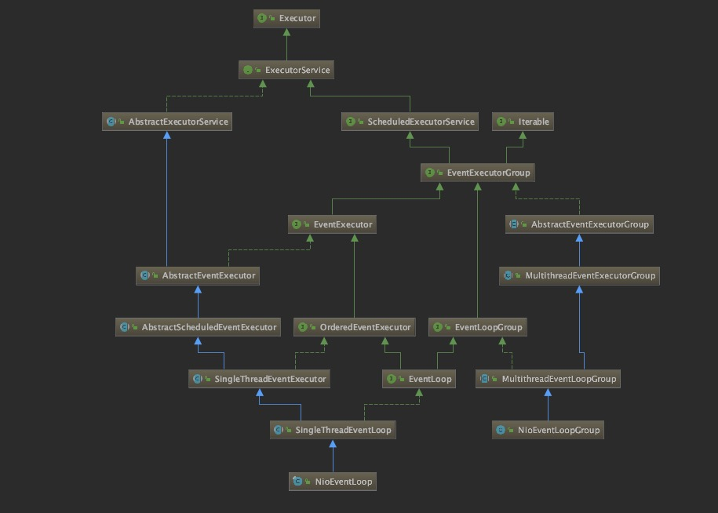

#### netty源码

##### netty 线程池



> netty 线程主要有两条线NioEventLoop、NioEventLoopGroup，即线程及线程池
>
> ```rust
> NioEventLoop --> SingleThreadEventLoop --> SingleThreadEventExecutor -->
> AbstractScheduledEventExecutor --> AbstractScheduledEventExecutor --> 
> AbstractEventExecutor --> AbstractExecutorService
> 
> NioEventLoopGroup --> MultithreadEventLoopGroup --> 
> MultithreadEventExecutorGroup --> AbstractEventExecutorGroup
> ```


MultithreadEventExecutorGroup实现了线程的创建和线程的选择，其中的字段为：

```java
// 线程池，数组形式可知为固定线程池
    private final EventExecutor[] children;
    // 线程索引，用于线程选择
    private final AtomicInteger childIndex = new AtomicInteger();
    // 终止的线程个数
    private final AtomicInteger terminatedChildren = new AtomicInteger();
    // 线程池终止时的异步结果
    private final Promise<?> terminationFuture = 
                          new DefaultPromise(GlobalEventExecutor.INSTANCE);
    // 线程选择器
    private final EventExecutorChooser chooser;


protected MultithreadEventExecutorGroup(int nThreads, 
                                        ThreadFactory threadFactory, Object... args){
  if (nThreads <= 0) {
    throw new IllegalArgumentException(String.format("nThreads: %d (expected: > 0)", nThreads));
  }

  if (executor == null) {
    executor = new ThreadPerTaskExecutor(newDefaultThreadFactory());
  }

  children = new EventExecutor[nThreads];

  for (int i = 0; i < nThreads; i ++) {
    boolean success = false;
    try {
			// 使用模板方法newChild实例化一个线程
      children[i] = newChild(executor, args);
      success = true;
    } catch (Exception e) {
      // TODO: Think about if this is a good exception type
      throw new IllegalStateException("failed to create a child event loop", e);
    } finally {
      if (!success) {
        //  如果不成功，所有已经实例化的线程优雅关闭
        for (int j = 0; j < i; j ++) {
          children[j].shutdownGracefully();
        }
				// 确保已经实例化的线程终止
        for (int j = 0; j < i; j ++) {
          EventExecutor e = children[j];
          try {
            while (!e.isTerminated()) {
              e.awaitTermination(Integer.MAX_VALUE, TimeUnit.SECONDS);
            }
          } catch (InterruptedException interrupted) {
            // Let the caller handle the interruption.
            Thread.currentThread().interrupt();
            break;
          }
        }
      }
    }
  }

  chooser = chooserFactory.newChooser(children);

  final FutureListener<Object> terminationListener = new FutureListener<Object>() {
    @Override
    public void operationComplete(Future<Object> future) throws Exception {
      if (terminatedChildren.incrementAndGet() == children.length) {
        terminationFuture.setSuccess(null);
      }
    }
  };

  for (EventExecutor e: children) {
    e.terminationFuture().addListener(terminationListener);
  }

  Set<EventExecutor> childrenSet = new LinkedHashSet<EventExecutor>(children.length);
  Collections.addAll(childrenSet, children);
  readonlyChildren = Collections.unmodifiableSet(childrenSet);
}

其中的nThreads表示线程池的固定线程数。
MultithreadEventExecutorGroup初始化的步骤是：
(1).设置线程工厂
(2).设置线程选择器
(3).实例化线程
(4).设置线程终止异步结果


```

