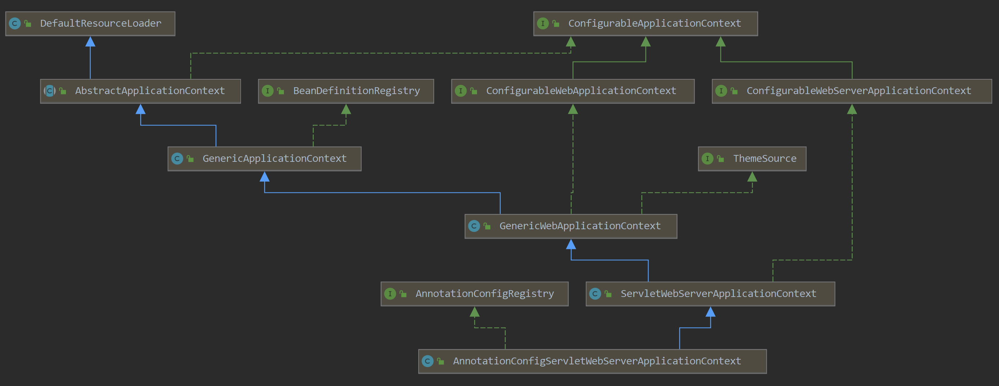

### Spring boot 源码

#### 知识储备

##### Spring Factories机制

`org.springframework.core.io.support.SpringFactoriesLoader` 的关键代码：

```java
public final class SpringFactoriesLoader {
	
	// 配置文件的路径,spring boot jar包下的文件
	public static final String FACTORIES_RESOURCE_LOCATION = "META-INF/spring.factories";
	
	......
	
	// 注意这里会加载多个jar中的“META-INF/spring.factories”文件
	public static List<String> loadFactoryNames(Class<?> factoryType, @Nullable ClassLoader classLoader) {
		String factoryTypeName = factoryType.getName();
		return loadSpringFactories(classLoader).getOrDefault(factoryTypeName, Collections.emptyList());
	}

    // 这里只是找到某个接口配置在spring.factories下的实现类，实例化一般在调用的地方通过反射实现
	private static Map<String, List<String>> loadSpringFactories(@Nullable ClassLoader classLoader) {
		MultiValueMap<String, String> result = cache.get(classLoader);
		if (result != null) {
			return result;
		}

		try {
			Enumeration<URL> urls = (classLoader != null ?
					classLoader.getResources(FACTORIES_RESOURCE_LOCATION) :
					ClassLoader.getSystemResources(FACTORIES_RESOURCE_LOCATION));
			result = new LinkedMultiValueMap<>();
			while (urls.hasMoreElements()) {
				URL url = urls.nextElement();
				UrlResource resource = new UrlResource(url);
				Properties properties = PropertiesLoaderUtils.loadProperties(resource);
				for (Map.Entry<?, ?> entry : properties.entrySet()) {
					String factoryTypeName = ((String) entry.getKey()).trim();
					for (String factoryImplementationName : StringUtils.commaDelimitedListToStringArray((String) entry.getValue())) {
						result.add(factoryTypeName, factoryImplementationName.trim());
					}
				}
			}
			cache.put(classLoader, result);
			return result;
		}
		catch (IOException ex) {
			throw new IllegalArgumentException("Unable to load factories from location [" +
					FACTORIES_RESOURCE_LOCATION + "]", ex);
		}
	}
	
	......

}
```

eg：例如spring-boot jar包下的META-INF/spring.factories 文件里以key=value,value的形式存在，一般key是某个接口，value就是接口的实现列表

```java
org.springframework.boot.BeanPostProcessor=\
org.springframework.boot.context.event.EventPublishingRunListener

```


#### SpringBoot 启动入口

```java
@SpringBootApplication
public class SbootMain {

    public static void main(String[] args) {
        // 传入启动类和启动参数
        SpringApplication.run(SbootMain.class, args);
    }
}
```

`org.springframework.boot.SpringApplication` 实例化部分代码

```java
public class SpringApplication {
    ······
    
     public static ConfigurableApplicationContext run(Class<?>[] primarySources, String[] args) {
		return new SpringApplication(primarySources).run(args);
	}

    public SpringApplication(Class<?>... primarySources) {
            this(null, primarySources);
        }

    // 实例化SpringApplication，启动类作为初始资源传入
    public SpringApplication(ResourceLoader resourceLoader, Class<?>... primarySources) {
            this.resourceLoader = resourceLoader;
            Assert.notNull(primarySources, "PrimarySources must not be null");
        	// 把启动类作为作为资源放入初始资源里
            this.primarySources = new LinkedHashSet<>(Arrays.asList(primarySources));
        	// 判断容器启动的方式，默认SERVLET 即启动一个Servlet容器
            this.webApplicationType = WebApplicationType.deduceFromClasspath();
        	// 加载并实例化classpath下jar包中的spring.factories中的ApplicationContextInitializer实现
            setInitializers((Collection) getSpringFactoriesInstances(ApplicationContextInitializer.class));
        	// 加载并实例化classpath下jar包中的spring.factories中的ApplicationListener实现
            setListeners((Collection) getSpringFactoriesInstances(ApplicationListener.class));
        	// 通过获取当前调用栈，找到入口方法main所在的类，并将其复制给SpringApplication对象的成员变量mainApplicationClass
            this.mainApplicationClass = deduceMainApplicationClass();
        }
    
    private Class<?> deduceMainApplicationClass() {
		try {
            //通过调用栈找到main方法的类
			StackTraceElement[] stackTrace = new RuntimeException().getStackTrace();
			for (StackTraceElement stackTraceElement : stackTrace) {
				if ("main".equals(stackTraceElement.getMethodName())) {
					return Class.forName(stackTraceElement.getClassName());
				}
			}
		}
		catch (ClassNotFoundException ex) {
			// Swallow and continue
		}
		return null;
	}
        
	······
}
```

ApplicationContextInitializer是一个可以用来初始化ApplicationContext的接口

```java
public interface ApplicationContextInitializer<C extends ConfigurableApplicationContext> {

	void initialize(C applicationContext);

}

spring boot 启动加载的ApplicationContextInitializer实现
org.springframework.boot.context.config.DelegatingApplicationContextInitializer
org.springframework.boot.autoconfigure.SharedMetadataReaderFactoryContextInitializer
org.springframework.boot.context.ContextIdApplicationContextInitializer
org.springframework.boot.context.ConfigurationWarningsApplicationContextInitializer
org.springframework.boot.rsocket.context.RSocketPortInfoApplicationContextInitializer
org.springframework.boot.web.context.ServerPortInfoApplicationContextInitializer
org.springframework.boot.autoconfigure.logging.ConditionEvaluationReportLoggingListener
```


ApplicationListener 是用来监听spring容器启动各阶段做相应初始化的接口

```java
@FunctionalInterface
public interface ApplicationListener<E extends ApplicationEvent> extends EventListener {

	/**
	 * Handle an application event.
	 * @param event the event to respond to
	 */
	void onApplicationEvent(E event);

}
ApplicationEvent 有很多实现代表着不同的事件，在容器启动过程的不同阶段会分别触发这些事件，监听器针对不同的事件作出相应的处理，后续分析中会具体讲述。

spring boot 启动过程中加载的ApplicationListener实现
org.springframework.boot.context.config.ConfigFileApplicationListener
org.springframework.boot.context.config.AnsiOutputApplicationListener
org.springframework.boot.context.logging.LoggingApplicationListener
org.springframework.boot.context.logging.ClasspathLoggingApplicationListener
org.springframework.boot.autoconfigure.BackgroundPreinitializer
org.springframework.boot.context.config.DelegatingApplicationListener
org.springframework.boot.builder.ParentContextCloserApplicationListener
org.springframework.boot.ClearCachesApplicationListener
org.springframework.boot.context.FileEncodingApplicationListener
org.springframework.boot.liquibase.LiquibaseServiceLocatorApplicationListener

```

##### run方法

`org.springframework.boot.SpringApplication#run` 关键部分代码，下列解释中的编号后续用对应部分的关键代码

```java
SpringApplication {
    
    ……
    
	public ConfigurableApplicationContext run(String... args) {
        // StopWatch是来自org.springframework.util的工具类，可以用来方便的记录程序的运行时间。
		StopWatch stopWatch = new StopWatch();
		stopWatch.start();
        
		ConfigurableApplicationContext context = null;
		Collection<SpringBootExceptionReporter> exceptionReporters = new ArrayList<>();
        // 设置headless模式,就是设置系统属性java.awt.headless，开发的是服务器程序，一般运行在没有显示器和键盘的环境。
		configureHeadlessProperty();
        // 1. 通过SpringFactoriesLoader加载SpringApplicationRunListener接口的实现，springboot 启动时有EventPublishingRunListener实现，通过反射实例化，构造方法中传入SpringApplication实例和启动参数，这里运用了观察者模式来触发之前注册的监听器
		SpringApplicationRunListeners listeners = getRunListeners(args);
        // 触发ApplicationStartingEvent事件
		listeners.starting();
		try {
            // 2. 可以看到是把main函数的args参数当做一个PropertySource来解析。我们的例子中，args的长度为0，所以这里创建的DefaultApplicationArguments也没有实际的内容。
			ApplicationArguments applicationArguments = new DefaultApplicationArguments(args);
            // 3. 创建并配置ApplicationConext的Environment
			ConfigurableEnvironment environment = prepareEnvironment(listeners, applicationArguments);
			configureIgnoreBeanInfo(environment);
            // 打印banner
			Banner printedBanner = printBanner(environment);
            // 4. 创建ApplicationContext容器，web环境创建AnnotationConfigServletWebServerApplicationContext
			context = createApplicationContext();
            //加载启动异常分析器
			exceptionReporters = getSpringFactoriesInstances(SpringBootExceptionReporter.class,
					new Class[] { ConfigurableApplicationContext.class }, context);
            // 5. 刷新应用上下文前的准备阶段
			prepareContext(context, environment, listeners, applicationArguments, printedBanner);
            // 刷新spring 容器，spring容器启动核心
			refreshContext(context);
            // 空实现
			afterRefresh(context, applicationArguments);
			stopWatch.stop();
			if (this.logStartupInfo) {
				new StartupInfoLogger(this.mainApplicationClass).logStarted(getApplicationLog(), stopWatch);
			}
            // 触发ApplicationStartedEvent事件
			listeners.started(context);
            //在某些情况下，我们希望在容器bean加载完成后执行一些操作，会实现ApplicationRunner或者CommandLineRunner接口后置操作，就是在容器完成刷新后，依次调用注册的Runners，还可以通过@Order注解设置各runner的执行顺序。
			callRunners(context, applicationArguments);
		}
		catch (Throwable ex) {
            // 触发容器启动失败ApplicationFailedEvent事件
			handleRunFailure(context, ex, exceptionReporters, listeners);
			throw new IllegalStateException(ex);
		}

		try {
            // 触发ApplicationReadyEvent事件
			listeners.running(context);
		}
		catch (Throwable ex) {
			handleRunFailure(context, ex, exceptionReporters, null);
			throw new IllegalStateException(ex);
		}
		return context;
	}
   	……
}
```

> AnnotationConfigServletWebServerApplicationContext的继承关系
>
> 

##### 1. 监听器

`org.springframework.boot.SpringApplicationRunListener` 接口，主要实现org.springframework.boot.context.event.EventPublishingRunListener，里面包含了SpringApplication实例化时加载的ApplicationListener 监听器，通过EventPublishingRunListener触发之前的监听器

```java
public interface SpringApplicationRunListener {

	// 第一次启动的时候，用来初始化，触发ApplicationStartingEvent事件
	default void starting() {
	}

	// 环境准备就绪之后和ApplicationContext就绪之前触发ApplicationEnvironmentPreparedEvent事件
	default void environmentPrepared(ConfigurableEnvironment environment) {
	}

    // ApplicationContext 创建就绪之后，资源加载之前触发ApplicationContextInitializedEvent事件
	default void contextPrepared(ConfigurableApplicationContext context) {
	}

    // ApplicationContext 资源加载完之后，refreshed之前触发ApplicationPreparedEvent事件
	default void contextLoaded(ConfigurableApplicationContext context) {
	}

    // ApplicationContext refreshed之后，CommandLineRunners、ApplicationRunner调用之前触发ApplicationStartedEvent事件
	default void started(ConfigurableApplicationContext context) {
	}

    // ApplicationContext refreshed之后和SpringApplication run方法完成之后触发ApplicationReadyEvent事件
	default void running(ConfigurableApplicationContext context) {
	}

    // 容器启动失败触发ApplicationFailedEvent事件
	default void failed(ConfigurableApplicationContext context, Throwable exception) {
	}

}
```

##### 2. 参数封装

`org.springframework.boot.DefaultApplicationArguments` 封装main方法的启动参数

```java
	public DefaultApplicationArguments(String... args) {
		Assert.notNull(args, "Args must not be null");
		this.source = new Source(args);
		this.args = args;
	}

	//org.springframework.boot.DefaultApplicationArguments.Source 
	Source(String[] args) {
			super(args);
		}
	//org.springframework.core.env.SimpleCommandLinePropertySource
	public SimpleCommandLinePropertySource(String... args) {
		super(new SimpleCommandLineArgsParser().parse(args));
	}
```

##### 3. 配置环境

`prepareEnvironmen`方法

创建并配置ApplicationConext的Environment，`org.springframework.boot.SpringApplication`，SpringApplication的Environment代表着程序运行的环境，主要包含了两种信息，一种是profiles，用来描述哪些bean definitions是可用的；一种是properties，用来描述系统的配置，其来源可能是配置文件、JVM属性文件、操作系统环境变量等等。

```java
SpringApplication{
    
    ……
    
    private ConfigurableEnvironment prepareEnvironment(SpringApplicationRunListeners listeners,
			ApplicationArguments applicationArguments) {
		// 创建并配置Environment,这里根据之前配置的webApplicationType创建StandardServletEnvironment
		ConfigurableEnvironment environment = getOrCreateEnvironment();
        // 配置上一步获取的Environment对象
		configureEnvironment(environment, applicationArguments.getSourceArgs());
		ConfigurationPropertySources.attach(environment);
        // 触发监听器ApplicationEnvironmentPreparedEvent事件
		listeners.environmentPrepared(environment);
		bindToSpringApplication(environment);
		if (!this.isCustomEnvironment) {
			environment = new EnvironmentConverter(getClassLoader()).convertEnvironmentIfNecessary(environment,
					deduceEnvironmentClass());
		}
		ConfigurationPropertySources.attach(environment);
		return environment;
	}
    
    ……
    
    protected void configureEnvironment(ConfigurableEnvironment environment, String[] args) {
		if (this.addConversionService) {
			ConversionService conversionService = ApplicationConversionService.getSharedInstance();
			environment.setConversionService((ConfigurableConversionService) conversionService);
		}
		configurePropertySources(environment, args);
		configureProfiles(environment, args);
	}
    
    // 首先查看SpringApplication对象的成员变量defaultProperties，如果该变量非null且内容非空，则将其加入到Environment的PropertySource列表的最后。然后查看SpringApplication对象的成员变量addCommandLineProperties和main函数的参数args，如果设置了addCommandLineProperties=true，且args个数大于0，那么就构造一个由main函数的参数组成的PropertySource放到Environment的PropertySource列表的最前面(这就能保证，我们通过main函数的参数来做的配置是最优先的，可以覆盖其他配置）
    protected void configurePropertySources(ConfigurableEnvironment environment, String[] args) {
		MutablePropertySources sources = environment.getPropertySources();
		if (this.defaultProperties != null && !this.defaultProperties.isEmpty()) {
			sources.addLast(new MapPropertySource("defaultProperties", this.defaultProperties));
		}
		if (this.addCommandLineProperties && args.length > 0) {
			String name = CommandLinePropertySource.COMMAND_LINE_PROPERTY_SOURCE_NAME;
			if (sources.contains(name)) {
				PropertySource<?> source = sources.get(name);
				CompositePropertySource composite = new CompositePropertySource(name);
				composite.addPropertySource(
						new SimpleCommandLinePropertySource("springApplicationCommandLineArgs", args));
				composite.addPropertySource(source);
				sources.replace(name, composite);
			}
			else {
				sources.addFirst(new SimpleCommandLinePropertySource(args));
			}
		}
	}
    
    // 首先会读取Properties中key为spring.profiles.active的配置项，配置到Environment，然后再将SpringApplication对象的成员变量additionalProfiles加入到Environment的active profiles配置中。
    protected void configureProfiles(ConfigurableEnvironment environment, String[] args) {
		Set<String> profiles = new LinkedHashSet<>(this.additionalProfiles);
		profiles.addAll(Arrays.asList(environment.getActiveProfiles()));
		environment.setActiveProfiles(StringUtils.toStringArray(profiles));
	}
        
    
    ……
}

```

##### 4. 创建容器

`createApplicationContext`方法

创建ApplicationContext容器

```java
SpringApplication{
	……
    
   /**
	 * The class name of application context that will be used by default for non-web
	 * environments.
	 */
	public static final String DEFAULT_CONTEXT_CLASS = "org.springframework.context."
			+ "annotation.AnnotationConfigApplicationContext";

	/**
	 * The class name of application context that will be used by default for web
	 * environments.
	 */
	public static final String DEFAULT_SERVLET_WEB_CONTEXT_CLASS = "org.springframework.boot."
			+ "web.servlet.context.AnnotationConfigServletWebServerApplicationContext";

	/**
	 * The class name of application context that will be used by default for reactive web
	 * environments.
	 */
	public static final String DEFAULT_REACTIVE_WEB_CONTEXT_CLASS = "org.springframework."
			+ "boot.web.reactive.context.AnnotationConfigReactiveWebServerApplicationContext";
    
    ……
	
	protected ConfigurableApplicationContext createApplicationContext() {
		Class<?> contextClass = this.applicationContextClass;
		if (contextClass == null) {
			try {
				switch (this.webApplicationType) {
				case SERVLET:
                    // springboot web 环境创建AnnotationConfigServletWebServerApplicationContext
					contextClass = Class.forName(DEFAULT_SERVLET_WEB_CONTEXT_CLASS);
					break;
				case REACTIVE:
					contextClass = Class.forName(DEFAULT_REACTIVE_WEB_CONTEXT_CLASS);
					break;
				default:
					contextClass = Class.forName(DEFAULT_CONTEXT_CLASS);
				}
			}
			catch (ClassNotFoundException ex) {
				throw new IllegalStateException(
						"Unable create a default ApplicationContext, please specify an ApplicationContextClass", ex);
			}
		}
		return (ConfigurableApplicationContext) BeanUtils.instantiateClass(contextClass);
	}

	……
}

// org.springframework.boot.web.servlet.context.AnnotationConfigServletWebServerApplicationContext
AnnotationConfigServletWebServerApplicationContext{
    ……
        
    public AnnotationConfigServletWebServerApplicationContext() {
        // 实例化了一个Bean读取器，并向BeanDefinitionMap中注册spring bean的工厂后置处理器BeanFactoryPostProcessor和spring bean的后置处理器BeanPostProcessor
		this.reader = new AnnotatedBeanDefinitionReader(this);
        // 初始化一个扫描器，这个扫描器在后面扫描包的时候，并没有用到，猜测是Spring为了满足其他的场景而初始化的
		this.scanner = new ClassPathBeanDefinitionScanner(this);
	}
    
        
   ……
}

// org.springframework.context.annotation.AnnotatedBeanDefinitionReader
AnnotatedBeanDefinitionReader{
    
    public AnnotatedBeanDefinitionReader(BeanDefinitionRegistry registry) {
		this(registry, getOrCreateEnvironment(registry));
	}

	
	public AnnotatedBeanDefinitionReader(BeanDefinitionRegistry registry, Environment environment) {
		Assert.notNull(registry, "BeanDefinitionRegistry must not be null");
		Assert.notNull(environment, "Environment must not be null");
		this.registry = registry;
		this.conditionEvaluator = new ConditionEvaluator(registry, environment, null);
        // 注册spring bean的工厂后置处理器BeanFactoryPostProcessor和spring bean的后置处理器BeanPostProcessor
        // ConfigurationClassPostProcessor spring bean 工厂后置处理器，解析@Configurable 后续详细讲解
        // AutowiredAnnotationBeanPostProcessor spring bean后置处理器，处理spring bean的自动注入
        // CommonAnnotationBeanPostProcessor 用来处理如@Resource，@PostConstruct等符合JSR-250规范的注解
        // EventListenerMethodProcessor
        // DefaultEventListenerFactory
		AnnotationConfigUtils.registerAnnotationConfigProcessors(this.registry);
	}
}
```

##### 5. 刷新上下文准备

`prepareContext` 方法

```java
SpringApplication{
    ……
    
    private void prepareContext(ConfigurableApplicationContext context, ConfigurableEnvironment environment,
			SpringApplicationRunListeners listeners, ApplicationArguments applicationArguments, Banner printedBanner) {
        // 设置容器环境
		context.setEnvironment(environment);
        // 注册bean name生成器
		postProcessApplicationContext(context);
        // 执行ApplicationContextInitializer
		applyInitializers(context);
        // 触发ApplicationContextInitializedEvent事件
		listeners.contextPrepared(context);
		if (this.logStartupInfo) {
			logStartupInfo(context.getParent() == null);
			logStartupProfileInfo(context);
		}
		// 注册spring boot 特殊的单例bean
		ConfigurableListableBeanFactory beanFactory = context.getBeanFactory();
        // 将main函数中的args参数封装成单例Bean，注册进容器
		beanFactory.registerSingleton("springApplicationArguments", applicationArguments);
        // 将 printedBanner 也封装成单例，注册进容器
		if (printedBanner != null) {
			beanFactory.registerSingleton("springBootBanner", printedBanner);
		}
		if (beanFactory instanceof DefaultListableBeanFactory) {
			((DefaultListableBeanFactory) beanFactory)
					.setAllowBeanDefinitionOverriding(this.allowBeanDefinitionOverriding);
		}
		if (this.lazyInitialization) {
            // 注册懒加载工厂后置处理器 BeanFactoryPostProcessor
			context.addBeanFactoryPostProcessor(new LazyInitializationBeanFactoryPostProcessor());
		}
		// Load the sources
		Set<Object> sources = getAllSources();
		Assert.notEmpty(sources, "Sources must not be empty");
        // //加载我们的启动类，将启动类注入容器
		load(context, sources.toArray(new Object[0]));
        // 触发ApplicationPreparedEvent事件
		listeners.contextLoaded(context);
	}
    
    ……
}
```

##### 6. 刷新上下文

```java
BeanPostProcessorSpringApplication{
	……
	
	private void refreshContext(ConfigurableApplicationContext context) {
		refresh(context);
		if (this.registerShutdownHook) {
			try {
				context.registerShutdownHook();
			}
			catch (AccessControlException ex) {
				// Not allowed in some environments.
			}
		}
	}
	
    protected void refresh(ApplicationContext applicationContext) {
		Assert.isInstanceOf(AbstractApplicationContext.class, applicationContext);
		((AbstractApplicationContext) applicationContext).refresh();
	}
    
	……
}

// org.springframework.context.support.AbstractApplicationContext
public abstract class AbstractApplicationContext extends DefaultResourceLoader
		implements ConfigurableApplicationContext {
    ……
    
    @Override
	public void refresh() throws BeansException, IllegalStateException {
		synchronized (this.startupShutdownMonitor) {
			// 刷新前准备，设置启动时间和活动状态
			prepareRefresh();

			// 由子类实现，springboot中由GenericApplicationContext实现，给beanFactory设置序列化id
			ConfigurableListableBeanFactory beanFactory = obtainFreshBeanFactory();

			// 设置容器的classLoader，注册两个bean后置处理器BeanPostProcessor和默认的环境bean
            // 1. ApplicationContextAwareProcessor处理实现了ApplicationContextAware接口的类，回调setApplicationContext()方法
            // 2. ApplicationListenerDetector用来检测ApplicationListener类的，当某个Bean实现了ApplicationListener接口的bean被创建好后，会被加入到监听器列表中
			prepareBeanFactory(beanFactory);

			try {
                //由子类实现，springboot中由GenericApplicationContext实现，如果是Servlet环境则注册一个后置处理器ServletContextAwareProcessor用来处理实现了ServletContextAware接口的bean
				postProcessBeanFactory(beanFactory);

				// 执行所有的BeanFactoryPostProcessor，包括自定义的，以及spring内置的。会先执行实现了BeanDefinitionRegistryPostProcessor接口的类，然后执行BeanFactoryPostProcessor的类
				invokeBeanFactoryPostProcessors(beanFactory);

				// 注册并实例化bean的后置处理器
				registerBeanPostProcessors(beanFactory);

				// 初始化MessageSource，用来做消息国际化。在一般项目中不会用到消息国际化
				initMessageSource();

				// 初始化事件广播器，如果容器中存在了名字为applicationEventMulticaster的广播器，则使用该广播器,如果没有，则初始化一个SimpleApplicationEventMulticaster 事件广播器的用途是，发布事件，并且为所发布的时间找到对应的事件监听器。
				initApplicationEventMulticaster();

				// 执行其他的初始化操作，在spring boot web项目里在父类ServletWebServerApplicationContext里初始化嵌入的web服务器
				onRefresh();

				// 这一步会将自定义的listener的bean名称放入到事件广播器中同时还会将早期的ApplicationEvent发布(对于单独的spring工程来说，在此时不会有任何ApplicationEvent发布，但是和springMVC整合时，springMVC会执行onRefresh()方法，在这里会发布事件)
				registerListeners();

				// 	实例化剩余的非懒加载的单例bean(注意：剩余、非懒加载、单例)为什么说是剩余呢？如果开发人员自定义了BeanPosrProcessor，而BeanPostProcessor在前面已经实例化了，所以在这里不会再实例化，因此这里使用剩余一词
				finishBeanFactoryInitialization(beanFactory);

				// 结束refresh，主要干了一件事，就是发布一个事件ContextRefreshEvent，通知大家spring容器refresh结束了。
				finishRefresh();
			}

			catch (BeansException ex) {
				if (logger.isWarnEnabled()) {
					logger.warn("Exception encountered during context initialization - " +
							"cancelling refresh attempt: " + ex);
				}

				// Destroy already created singletons to avoid dangling resources.
				destroyBeans();

				// Reset 'active' flag.
				cancelRefresh(ex);

				// Propagate exception to caller.
				throw ex;
			}

			finally {
				// Reset common introspection caches in Spring's core, since we
				// might not ever need metadata for singleton beans anymore...
				resetCommonCaches();
			}
		}
	}
        
	……  
}

//org.springframework.context.support.PostProcessorRegistrationDelegate#invokeBeanFactoryPostProcessors 执行spring bean工厂后置处理器BeanFactoryPostProcessor的关键代码
// 注册bean的后置处理器 BeanPostProcessor
PostProcessorRegistrationDelegate{
    ……
        
    public static void invokeBeanFactoryPostProcessors(
			ConfigurableListableBeanFactory beanFactory, List<BeanFactoryPostProcessor> beanFactoryPostProcessors) {

		// Invoke BeanDefinitionRegistryPostProcessors first, if any.
		Set<String> processedBeans = new HashSet<>();

        //BeanDefinitionRegistryPostProcessor是BeanFactoryPostProcessor的子接口，先处理BeanDefinitionRegistryPostProcessor#postProcessBeanDefinitionRegistry，在处理BeanFactoryPostProcessor#postProcessBeanFactory
        //org.springframework.boot.autoconfigure.SharedMetadataReaderFactoryContextInitializer$CachingMetadataReaderFactoryPostProcessor, org.springframework.boot.context.ConfigurationWarningsApplicationContextInitializer$ConfigurationWarningsPostProcessor, org.springframework.boot.context.config.ConfigFileApplicationListener$PropertySourceOrderingPostProcessor
        //这三个工厂后置处理器是通过ApplicationContextInitializer或者ApplicationListener注册的
		if (beanFactory instanceof BeanDefinitionRegistry) {
			BeanDefinitionRegistry registry = (BeanDefinitionRegistry) beanFactory;
			List<BeanFactoryPostProcessor> regularPostProcessors = new ArrayList<>();
			List<BeanDefinitionRegistryPostProcessor> registryProcessors = new ArrayList<>();

			for (BeanFactoryPostProcessor postProcessor : beanFactoryPostProcessors) {
				if (postProcessor instanceof BeanDefinitionRegistryPostProcessor) {
					BeanDefinitionRegistryPostProcessor registryProcessor =
							(BeanDefinitionRegistryPostProcessor) postProcessor;
					registryProcessor.postProcessBeanDefinitionRegistry(registry);
					registryProcessors.add(registryProcessor);
				}
				else {
					regularPostProcessors.add(postProcessor);
				}
			}

            //这里不需要初始化FactoryBeans，我们需要保留所有常规bean的未初始化状态，以便让bean工厂后处理程序应用于它们！分离实现了PriorityOrdered, Ordered的工厂后置处理器，排序之后调用
			List<BeanDefinitionRegistryPostProcessor> currentRegistryProcessors = new ArrayList<>();

			// BeanDefinitionRegistryPostProcessors 实现了 PriorityOrdered 的工厂后置处理器，这里有个比较重要的工厂后置处理器ConfigurationClassPostProcessor，postProcessBeanDefinitionRegistry()方法进行了@Configuration类的解析，@ComponentScan的扫描，以及@Import注解的处理，详细后续分析
			String[] postProcessorNames =
					beanFactory.getBeanNamesForType(BeanDefinitionRegistryPostProcessor.class, true, false);
			for (String ppName : postProcessorNames) {
				if (beanFactory.isTypeMatch(ppName, PriorityOrdered.class)) {
					currentRegistryProcessors.add(beanFactory.getBean(ppName, BeanDefinitionRegistryPostProcessor.class));
					processedBeans.add(ppName);
				}
			}
			sortPostProcessors(currentRegistryProcessors, beanFactory);
			registryProcessors.addAll(currentRegistryProcessors);
			invokeBeanDefinitionRegistryPostProcessors(currentRegistryProcessors, registry);
			currentRegistryProcessors.clear();

			// BeanDefinitionRegistryPostProcessors 实现了 Ordered，在springboot 启动debug过程中这里没有处理器
			postProcessorNames = beanFactory.getBeanNamesForType(BeanDefinitionRegistryPostProcessor.class, true, false);
			for (String ppName : postProcessorNames) {
				if (!processedBeans.contains(ppName) && beanFactory.isTypeMatch(ppName, Ordered.class)) {
					currentRegistryProcessors.add(beanFactory.getBean(ppName, BeanDefinitionRegistryPostProcessor.class));
					processedBeans.add(ppName);
				}
			}
			sortPostProcessors(currentRegistryProcessors, beanFactory);
			registryProcessors.addAll(currentRegistryProcessors);
			invokeBeanDefinitionRegistryPostProcessors(currentRegistryProcessors, registry);
			currentRegistryProcessors.clear();

			//调用所有其他BeanDefinitionRegistryPostProcessor，比如mybatis的MapperScannerConfigurer工厂后置处理器就是这里执行的，配置和扫描mybatis相关的bean
			boolean reiterate = true;
			while (reiterate) {
				reiterate = false;
				postProcessorNames = beanFactory.getBeanNamesForType(BeanDefinitionRegistryPostProcessor.class, true, false);
				for (String ppName : postProcessorNames) {
					if (!processedBeans.contains(ppName)) {
						currentRegistryProcessors.add(beanFactory.getBean(ppName, BeanDefinitionRegistryPostProcessor.class));
						processedBeans.add(ppName);
						reiterate = true;
					}
				}
				sortPostProcessors(currentRegistryProcessors, beanFactory);
				registryProcessors.addAll(currentRegistryProcessors);
				invokeBeanDefinitionRegistryPostProcessors(currentRegistryProcessors, registry);
				currentRegistryProcessors.clear();
			}

			// 现在，调用到目前为止处理的所有处理器的postProcessBeanFactory回调。
			invokeBeanFactoryPostProcessors(registryProcessors, beanFactory);
			invokeBeanFactoryPostProcessors(regularPostProcessors, beanFactory);
		}

		else {
			// Invoke factory processors registered with the context instance.
			invokeBeanFactoryPostProcessors(beanFactoryPostProcessors, beanFactory);
		}

		// Do not initialize FactoryBeans here: We need to leave all regular beans
		// uninitialized to let the bean factory post-processors apply to them!
		String[] postProcessorNames =
				beanFactory.getBeanNamesForType(BeanFactoryPostProcessor.class, true, false);

        // 分离出分别实现了PriorityOrdered和Ordered接口的BeanFactoryPostProcessor
		List<BeanFactoryPostProcessor> priorityOrderedPostProcessors = new ArrayList<>();
		List<String> orderedPostProcessorNames = new ArrayList<>();
		List<String> nonOrderedPostProcessorNames = new ArrayList<>();
		for (String ppName : postProcessorNames) {
			if (processedBeans.contains(ppName)) {
				// 在上面处理BeanDefinitionRegistryPostProcessor的时候执行过的跳过
			}
			else if (beanFactory.isTypeMatch(ppName, PriorityOrdered.class)) {
				priorityOrderedPostProcessors.add(beanFactory.getBean(ppName, BeanFactoryPostProcessor.class));
			}
			else if (beanFactory.isTypeMatch(ppName, Ordered.class)) {
				orderedPostProcessorNames.add(ppName);
			}
			else {
				nonOrderedPostProcessorNames.add(ppName);
			}
		}

		// 先执行实现了PriorityOrdered 接口的BeanFactoryPostProcessor，这里有个重要的后置处理PropertySourcesPlaceholderConfigurer，允许用 Properties 文件中的属性来定义应用上下文（配置文件或者注解）
		sortPostProcessors(priorityOrderedPostProcessors, beanFactory);
		invokeBeanFactoryPostProcessors(priorityOrderedPostProcessors, beanFactory);

		// 再执行实现了Ordered接口的BeanFactoryPostProcessor，这里也有一个重要的后置处理器ConfigurationPropertiesBeanDefinitionValidator，属性绑定后置处理器
		List<BeanFactoryPostProcessor> orderedPostProcessors = new ArrayList<>(orderedPostProcessorNames.size());
		for (String postProcessorName : orderedPostProcessorNames) {
			orderedPostProcessors.add(beanFactory.getBean(postProcessorName, BeanFactoryPostProcessor.class));
		}
		sortPostProcessors(orderedPostProcessors, beanFactory);
		invokeBeanFactoryPostProcessors(orderedPostProcessors, beanFactory);

		// 最后是其他的BeanFactoryPostProcessor，这里也有两个处理器
        // 1. EventListenerMethodProcessor,用来将应用中每个使用@EventListener注解定义的事件监听方法变成一个ApplicationListener实例注册到容器
        // 2. ErrorMvcAutoConfiguration$PreserveErrorControllerTargetClassPostProcessor,它的目的是为ErrorController bean的定义设置属性preserveTargetClass:true,从而确保ErrorController bean如果有代理对象的话代理对象总是代理在类上而不是接口上。
		List<BeanFactoryPostProcessor> nonOrderedPostProcessors = new ArrayList<>(nonOrderedPostProcessorNames.size());
		for (String postProcessorName : nonOrderedPostProcessorNames) {
			nonOrderedPostProcessors.add(beanFactory.getBean(postProcessorName, BeanFactoryPostProcessor.class));
		}
		invokeBeanFactoryPostProcessors(nonOrderedPostProcessors, beanFactory);

		// Clear cached merged bean definitions since the post-processors might have
		// modified the original metadata, e.g. replacing placeholders in values...
		beanFactory.clearMetadataCache();
	}
    
    ……
        
    public static void registerBeanPostProcessors(
			ConfigurableListableBeanFactory beanFactory, AbstractApplicationContext applicationContext) {

		String[] postProcessorNames = beanFactory.getBeanNamesForType(BeanPostProcessor.class, true, false);

		// 注册BeanPostProcessorChecker，在BeanPostProcessor实例化期间创建一个bean时，即当一个bean不适合由所有BeanPostProcessor处理时，记录一条信息消息。
		int beanProcessorTargetCount = beanFactory.getBeanPostProcessorCount() + 1 + postProcessorNames.length;
		beanFactory.addBeanPostProcessor(new BeanPostProcessorChecker(beanFactory, beanProcessorTargetCount));

        // 分离分别实现了PriorityOrdered和Ordered，还有其他BeanPostProcessor
		List<BeanPostProcessor> priorityOrderedPostProcessors = new ArrayList<>();
		List<BeanPostProcessor> internalPostProcessors = new ArrayList<>();
		List<String> orderedPostProcessorNames = new ArrayList<>();
		List<String> nonOrderedPostProcessorNames = new ArrayList<>();
		for (String ppName : postProcessorNames) {
			if (beanFactory.isTypeMatch(ppName, PriorityOrdered.class)) {
				BeanPostProcessor pp = beanFactory.getBean(ppName, BeanPostProcessor.class);
				priorityOrderedPostProcessors.add(pp);
				if (pp instanceof MergedBeanDefinitionPostProcessor) {
					internalPostProcessors.add(pp);
				}
			}
			else if (beanFactory.isTypeMatch(ppName, Ordered.class)) {
				orderedPostProcessorNames.add(ppName);
			}
			else {
				nonOrderedPostProcessorNames.add(ppName);
			}
		}

		// 先注册和实例化实现了PriorityOrdered接口的BeanPostProcessor，这里有三个重要的处理器org.springframework.boot.context.properties.ConfigurationPropertiesBindingPostProcessor, org.springframework.context.annotation.CommonAnnotationBeanPostProcessor, org.springframework.beans.factory.annotation.AutowiredAnnotationBeanPostProcessor
		sortPostProcessors(priorityOrderedPostProcessors, beanFactory);
		registerBeanPostProcessors(beanFactory, priorityOrderedPostProcessors);

		// 再注册和实例化实现了Ordered接口的BeanPostProcessor，MethodValidationPostProcessor, DataSourceInitializerPostProcessor, AnnotationAwareAspectJAutoProxyCreator, PersistenceExceptionTranslationPostProcessor
		List<BeanPostProcessor> orderedPostProcessors = new ArrayList<>(orderedPostProcessorNames.size());
		for (String ppName : orderedPostProcessorNames) {
			BeanPostProcessor pp = beanFactory.getBean(ppName, BeanPostProcessor.class);
			orderedPostProcessors.add(pp);
			if (pp instanceof MergedBeanDefinitionPostProcessor) {
				internalPostProcessors.add(pp);
			}
		}
		sortPostProcessors(orderedPostProcessors, beanFactory);
		registerBeanPostProcessors(beanFactory, orderedPostProcessors);

		// org.springframework.boot.web.server.WebServerFactoryCustomizerBeanPostProcessor, org.springframework.boot.web.server.ErrorPageRegistrarBeanPostProcessor, org.springframework.data.web.config.ProjectingArgumentResolverRegistrar$ProjectingArgumentResolverBeanPostProcessor
		List<BeanPostProcessor> nonOrderedPostProcessors = new ArrayList<>(nonOrderedPostProcessorNames.size());
		for (String ppName : nonOrderedPostProcessorNames) {
			BeanPostProcessor pp = beanFactory.getBean(ppName, BeanPostProcessor.class);
			nonOrderedPostProcessors.add(pp);
			if (pp instanceof MergedBeanDefinitionPostProcessor) {
				internalPostProcessors.add(pp);
			}
		}
		registerBeanPostProcessors(beanFactory, nonOrderedPostProcessors);

		// 最后，重新注册所有内部beanPostProcessor，放到后置处理器的末端
		sortPostProcessors(internalPostProcessors, beanFactory);
		registerBeanPostProcessors(beanFactory, internalPostProcessors);

		// 重新注册后处理程序，以检测内部bean作为应用程序侦听器，将其移动到处理器链的末端（用于获取代理等）。
		beanFactory.addBeanPostProcessor(new ApplicationListenerDetector(applicationContext));
	}
}
```

##### 7. 实例化bean

org.springframework.beans.factory.support.DefaultListableBeanFactory#preInstantiateSingletons

```java
DefaultListableBeanFactory{
	……

	public void preInstantiateSingletons() throws BeansException {
		if (logger.isTraceEnabled()) {
			logger.trace("Pre-instantiating singletons in " + this);
		}

		// Iterate over a copy to allow for init methods which in turn register new bean definitions.
		// While this may not be part of the regular factory bootstrap, it does otherwise work fine.
		List<String> beanNames = new ArrayList<>(this.beanDefinitionNames);

		// Trigger initialization of all non-lazy singleton beans...
		for (String beanName : beanNames) {
			RootBeanDefinition bd = getMergedLocalBeanDefinition(beanName);
			if (!bd.isAbstract() && bd.isSingleton() && !bd.isLazyInit()) {
				if (isFactoryBean(beanName)) {
					Object bean = getBean(FACTORY_BEAN_PREFIX + beanName);
					if (bean instanceof FactoryBean) {
						final FactoryBean<?> factory = (FactoryBean<?>) bean;
						boolean isEagerInit;
						if (System.getSecurityManager() != null && factory instanceof SmartFactoryBean) {
							isEagerInit = AccessController.doPrivileged((PrivilegedAction<Boolean>)
											((SmartFactoryBean<?>) factory)::isEagerInit,
									getAccessControlContext());
						}
						else {
							isEagerInit = (factory instanceof SmartFactoryBean &&
									((SmartFactoryBean<?>) factory).isEagerInit());
						}
						if (isEagerInit) {
							getBean(beanName);
						}
					}
				}
				else {
					getBean(beanName);
				}
			}
		}

		// Trigger post-initialization callback for all applicable beans...
		for (String beanName : beanNames) {
			Object singletonInstance = getSingleton(beanName);
			if (singletonInstance instanceof SmartInitializingSingleton) {
				final SmartInitializingSingleton smartSingleton = (SmartInitializingSingleton) singletonInstance;
				if (System.getSecurityManager() != null) {
					AccessController.doPrivileged((PrivilegedAction<Object>) () -> {
						smartSingleton.afterSingletonsInstantiated();
						return null;
					}, getAccessControlContext());
				}
				else {
					smartSingleton.afterSingletonsInstantiated();
				}
			}
		}
	}
	
	……
}
```

